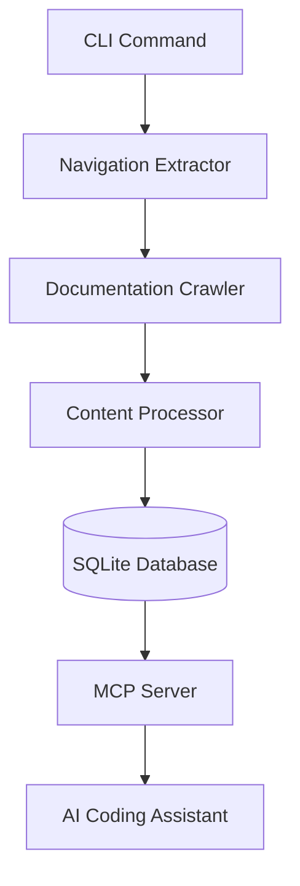

# Design Document

## Overview

The Jedi-MCP system is a Python CLI application that transforms technical documentation websites into MCP servers. The system uses a pipeline architecture: CLI → AI-powered navigation extraction → content crawling → intelligent grouping and summarization → SQLite storage → MCP server exposure. Each content group becomes an MCP tool that AI coding assistants can invoke to retrieve detailed documentation context.

The system leverages the Strands SDK for AI-powered content analysis and the FastMCP library for MCP server implementation. UV manages the Python environment and dependencies.

## Architecture

### High-Level Architecture



### Component Interaction Flow

1. User executes CLI command with documentation URL and project name
2. Navigation Extractor uses Strands SDK to identify relevant documentation links
3. Documentation Crawler fetches content from identified pages
4. Content Processor groups related pages and generates detailed summaries using Strands SDK
5. System stores content groups in SQLite with markdown-formatted summaries
6. MCP Server reads from SQLite and exposes each content group as an MCP tool
7. AI coding assistants connect to the MCP server and invoke tools to retrieve documentation

## Components and Interfaces

### 1. CLI Command Handler

**Responsibility**: Parse command-line arguments and orchestrate the documentation generation process.

**Interface**:
```python
def generate_mcp_server(url: str, name: str, config: Optional[Config] = None) -> GenerationResult:
    """
    Generate an MCP server from a documentation URL.
    
    Args:
        url: Root documentation URL to process
        name: Project name for the generated MCP server
        config: Optional configuration for crawling behavior
        
    Returns:
        GenerationResult containing status and output path
    """
```

**Key Operations**:
- Validate input parameters (URL format, name validity)
- Initialize database for the project
- Coordinate pipeline execution
- Handle errors and provide user feedback

### 2. Navigation Extractor

**Responsibility**: Use AI to identify and extract relevant documentation links from the root page.

**Interface**:
```python
def extract_navigation_links(html_content: str, base_url: str) -> List[DocumentationLink]:
    """
    Extract documentation links from navigation/sidebar elements using AI.
    
    Args:
        html_content: HTML content of the root documentation page
        base_url: Base URL for resolving relative links
        
    Returns:
        List of DocumentationLink objects with URLs and metadata
    """
```

**Implementation Details**:
- Uses Strands SDK Agent to analyze HTML structure
- Identifies navigation, sidebar, and menu elements
- Filters out external links, social media, and non-documentation pages
- Returns structured list of documentation URLs to crawl

### 3. Documentation Crawler

**Responsibility**: Fetch content from identified documentation pages with retry logic.

**Interface**:
```python
def crawl_pages(links: List[DocumentationLink], config: CrawlConfig) -> List[PageContent]:
    """
    Crawl documentation pages and extract main content.
    
    Args:
        links: List of documentation links to crawl
        config: Configuration for rate limiting and retries
        
    Returns:
        List of PageContent objects with extracted content
    """
```

**Implementation Details**:
- Uses requests library with retry decorator (max 3 retries)
- Implements rate limiting to respect documentation servers
- Extracts main content using BeautifulSoup, excluding nav/footer
- Preserves code blocks and markdown structure
- Returns content with URL, title, and extracted text

### 4. Content Processor

**Responsibility**: Group related documentation pages and generate detailed summaries using Strands SDK.

**Interface**:
```python
def process_content(pages: List[PageContent]) -> List[ContentGroup]:
    """
    Group related pages and generate detailed summaries.
    
    Args:
        pages: List of crawled page content
        
    Returns:
        List of ContentGroup objects with summaries
    """
```

**Implementation Details**:
- Uses Strands SDK Agent to analyze content relationships
- Groups pages by topic, API category, or conceptual similarity
- Generates detailed markdown-formatted summaries for each group
- Includes code examples, API signatures, and key concepts in summaries
- Ensures summaries provide sufficient context for AI coding assistance

### 5. Database Manager

**Responsibility**: Manage SQLite database schema and CRUD operations for content groups.

**Interface**:
```python
class DatabaseManager:
    def initialize_schema(self, project_name: str) -> None:
        """Create database schema if it doesn't exist."""
        
    def store_content_group(self, group: ContentGroup) -> int:
        """Store a content group and return its ID."""
        
    def get_all_content_groups(self, project_name: str) -> List[ContentGroup]:
        """Retrieve all content groups for a project."""
        
    def get_content_group_by_name(self, project_name: str, group_name: str) -> Optional[ContentGroup]:
        """Retrieve a specific content group by name."""
```

**Schema Design**:
```sql
CREATE TABLE projects (
    id INTEGER PRIMARY KEY AUTOINCREMENT,
    name TEXT UNIQUE NOT NULL,
    root_url TEXT NOT NULL,
    created_at TIMESTAMP DEFAULT CURRENT_TIMESTAMP
);

CREATE TABLE content_groups (
    id INTEGER PRIMARY KEY AUTOINCREMENT,
    project_id INTEGER NOT NULL,
    name TEXT NOT NULL,
    summary_markdown TEXT NOT NULL,
    created_at TIMESTAMP DEFAULT CURRENT_TIMESTAMP,
    FOREIGN KEY (project_id) REFERENCES projects(id),
    UNIQUE(project_id, name)
);

CREATE TABLE pages (
    id INTEGER PRIMARY KEY AUTOINCREMENT,
    content_group_id INTEGER NOT NULL,
    url TEXT NOT NULL,
    title TEXT NOT NULL,
    content TEXT NOT NULL,
    FOREIGN KEY (content_group_id) REFERENCES content_groups(id)
);

CREATE INDEX idx_content_groups_project ON content_groups(project_id);
CREATE INDEX idx_pages_group ON pages(content_group_id);
```

### 6. MCP Server

**Responsibility**: Expose content groups as MCP tools using FastMCP.

**Interface**:
```python
def create_mcp_server(project_name: str, db_manager: DatabaseManager) -> FastMCP:
    """
    Create an MCP server for a documentation project.
    
    Args:
        project_name: Name of the documentation project
        db_manager: Database manager for retrieving content
        
    Returns:
        Configured FastMCP server instance
    """
```

**Implementation Details**:
- Uses FastMCP library to create MCP server
- Dynamically registers tools based on content groups in database
- Each tool returns the markdown-formatted summary for its content group
- Tool names are derived from content group names (sanitized for MCP compatibility)
- Tool descriptions are generated from summary excerpts

**Example Tool Registration**:
```python
@mcp.tool(description="Sequelize model definition and usage documentation")
def sequelize_models() -> str:
    """Retrieve documentation for Sequelize models."""
    group = db_manager.get_content_group_by_name("sequelize", "models")
    return group.summary_markdown
```

## Data Models

### DocumentationLink
```python
@dataclass
class DocumentationLink:
    url: str
    title: Optional[str]
    category: Optional[str]  # Extracted from navigation structure
```

### PageContent
```python
@dataclass
class PageContent:
    url: str
    title: str
    content: str  # Extracted main content
    code_blocks: List[str]  # Preserved code examples
```

### ContentGroup
```python
@dataclass
class ContentGroup:
    name: str
    summary_markdown: str  # Detailed summary in markdown format
    pages: List[PageContent]  # Source pages for this group
```

### Config
```python
@dataclass
class CrawlConfig:
    rate_limit_delay: float = 0.5  # Seconds between requests
    max_retries: int = 3
    timeout: int = 30  # Request timeout in seconds
    custom_headers: Optional[Dict[str, str]] = None
```

## Correctness Properties

*A property is a characteristic or behavior that should hold true across all valid executions of a system-essentially, a formal statement about what the system should do. Properties serve as the bridge between human-readable specifications and machine-verifiable correctness guarantees.*


### CLI Validation and Execution

Property 1: CLI parameter validation
*For any* CLI invocation, if required parameters (URL and name) are missing, the system should reject the invocation with a clear error message
**Validates: Requirements 1.1, 1.4**

Property 2: Configuration propagation
*For any* optional configuration provided to the CLI, those settings should be passed through and applied during the generation process
**Validates: Requirements 1.5**

Property 3: Successful generation output
*For any* successful documentation generation, the CLI output should contain a confirmation message with the MCP server location
**Validates: Requirements 1.3**

### Navigation Extraction

Property 4: Navigation link extraction completeness
*For any* documentation root page with navigation elements, all documentation links within those elements should be extracted and external/non-content links should be filtered out
**Validates: Requirements 2.2, 2.3**

### Content Crawling

Property 5: Content extraction excludes non-content elements
*For any* crawled documentation page, the extracted content should not contain navigation, footer, or other non-content elements
**Validates: Requirements 3.2**

Property 6: Retry behavior on network errors
*For any* network error or timeout during crawling, exactly 3 retry attempts should occur before marking the page as failed
**Validates: Requirements 3.3**

Property 7: Crawl result completeness
*For any* completed crawl operation, all successfully retrieved pages should include their URL, title, and content
**Validates: Requirements 3.4**

### Content Processing and Grouping

Property 8: Content grouping with summaries
*For any* set of crawled documentation pages, the Content Processor should group related pages and generate a detailed summary for each group using Strands SDK
**Validates: Requirements 4.2, 4.3, 4.5**

Property 9: Summary content preservation
*For any* content group containing code examples or API signatures, those elements should be preserved in the generated markdown summary
**Validates: Requirements 4.4, 9.4**

### Database Storage

Property 10: Schema initialization
*For any* new documentation project, if the database schema does not exist, it should be created during initialization
**Validates: Requirements 5.1**

Property 11: Storage completeness
*For any* content group stored in the database, the group name, markdown-formatted summary, and all associated page URLs should be persisted with maintained relationships
**Validates: Requirements 5.2, 5.4, 5.5**

Property 12: Markdown formatting in storage
*For any* stored content group summary, the content should contain valid markdown syntax including headings, code blocks, and lists where appropriate
**Validates: Requirements 5.3**

### MCP Server and Tool Exposure

Property 13: Tool creation from content groups
*For any* content group in the database, the MCP Server should create and register an MCP tool with a name derived from the group name and a description based on the summary
**Validates: Requirements 6.2, 6.3, 6.5**

Property 14: Tool invocation returns markdown
*For any* MCP tool invocation, the server should retrieve and return the full markdown-formatted summary from the database
**Validates: Requirements 6.4**

Property 15: Tool list completeness
*For any* tool list request to the MCP Server, all registered content group tools should be returned
**Validates: Requirements 7.3**

Property 16: Error logging
*For any* error encountered during MCP Server operation, a clear error message should be logged
**Validates: Requirements 7.4**

### Format Preservation

Property 17: HTML semantic structure preservation
*For any* HTML documentation content, the extracted text should preserve semantic structure including headings and lists
**Validates: Requirements 9.1**

Property 18: Code block format preservation
*For any* documentation page containing code blocks, the code formatting and syntax information should be preserved during extraction
**Validates: Requirements 9.2**

Property 19: Markdown structure preservation
*For any* HTML content containing markdown-formatted text, the markdown structure should be parsed and preserved
**Validates: Requirements 9.3**

## Error Handling

### Error Categories

1. **Input Validation Errors**
   - Invalid URL format
   - Missing required parameters
   - Invalid project name characters

2. **Network Errors**
   - Connection timeouts
   - DNS resolution failures
   - HTTP error responses (4xx, 5xx)
   - SSL/TLS errors

3. **Content Processing Errors**
   - Malformed HTML
   - Empty or invalid content
   - Strands SDK API failures

4. **Database Errors**
   - Schema creation failures
   - Constraint violations
   - Connection errors

5. **MCP Server Errors**
   - Tool registration failures
   - Connection handling errors
   - Tool invocation errors

### Error Handling Strategy

**Retry Logic**: Network errors trigger automatic retries (max 3 attempts) with exponential backoff.

**Graceful Degradation**: If some pages fail to crawl, the system continues processing successfully retrieved pages.

**User Feedback**: All errors include clear, actionable messages indicating what went wrong and potential solutions.

**Logging**: Comprehensive logging at DEBUG, INFO, WARNING, and ERROR levels for troubleshooting.

**Validation**: Input validation occurs early in the pipeline to fail fast on invalid inputs.

## Testing Strategy

### Unit Testing

The system will use pytest for unit testing with the following focus areas:

**Component-Level Tests**:
- CLI argument parsing and validation
- URL extraction and filtering logic
- HTML content extraction
- Database CRUD operations
- MCP tool registration and invocation

**Mock External Dependencies**:
- HTTP requests (using responses library)
- Strands SDK calls (using unittest.mock)
- Database connections (using in-memory SQLite)

**Edge Cases**:
- Empty documentation pages
- Malformed HTML
- Network timeouts
- Database constraint violations

### Property-Based Testing

The system will use Hypothesis for property-based testing to verify universal properties across many inputs.

**Configuration**:
- Minimum 100 iterations per property test
- Each property test tagged with format: `**Feature: doc-to-mcp-server, Property {number}: {property_text}**`

**Property Test Coverage**:
- Property 1: CLI parameter validation with generated valid/invalid inputs
- Property 4: Navigation extraction with generated HTML structures
- Property 5: Content extraction with generated HTML containing nav/footer elements
- Property 6: Retry behavior with simulated network failures
- Property 7: Crawl result structure validation
- Property 8: Content grouping behavior
- Property 9: Code preservation in summaries
- Property 10: Schema initialization idempotence
- Property 11: Storage completeness with generated content groups
- Property 12: Markdown syntax validation in stored content
- Property 13: Tool creation from generated content groups
- Property 14: Tool invocation return values
- Property 15: Tool list completeness
- Property 17-19: Format preservation with generated HTML/markdown content

**Property Testing Library**: Hypothesis (Python)

**Test Generators**:
- URL generators (valid/invalid formats)
- HTML structure generators (with/without navigation elements)
- Content group generators (with varying page counts and content types)
- Markdown content generators (with code blocks, headings, lists)

### Integration Testing

**End-to-End Workflow Tests**:
- Complete pipeline from CLI to MCP server creation
- MCP server connection and tool invocation
- Database persistence and retrieval

**External Service Integration**:
- Strands SDK integration tests (with real API calls in CI)
- FastMCP server functionality tests

### Test Organization

```
tests/
├── unit/
│   ├── test_cli.py
│   ├── test_navigation_extractor.py
│   ├── test_crawler.py
│   ├── test_content_processor.py
│   ├── test_database.py
│   └── test_mcp_server.py
├── property/
│   ├── test_cli_properties.py
│   ├── test_extraction_properties.py
│   ├── test_storage_properties.py
│   └── test_format_properties.py
└── integration/
    ├── test_pipeline.py
    └── test_mcp_integration.py
```

## Implementation Notes

### Technology Stack

- **Python**: 3.10+
- **Package Manager**: UV with venv
- **CLI Framework**: Click or Typer
- **HTTP Client**: httpx (async support)
- **HTML Parsing**: BeautifulSoup4
- **AI SDK**: Strands SDK
- **MCP Library**: FastMCP
- **Database**: SQLite3 (built-in)
- **Testing**: pytest, Hypothesis, responses

### Dependencies

```toml
[project]
name = "jedi-mcp"
version = "0.1.0"
dependencies = [
    "strands-agents>=0.1.0",
    "fastmcp>=0.1.0",
    "httpx>=0.24.0",
    "beautifulsoup4>=4.12.0",
    "click>=8.1.0",
    "lxml>=4.9.0",
]

[project.optional-dependencies]
dev = [
    "pytest>=7.4.0",
    "hypothesis>=6.82.0",
    "responses>=0.23.0",
    "pytest-asyncio>=0.21.0",
]
```

### Project Structure

```
jedi-mcp/
├── src/
│   └── jedi_mcp/
│       ├── __init__.py
│       ├── cli.py
│       ├── navigation_extractor.py
│       ├── crawler.py
│       ├── content_processor.py
│       ├── database.py
│       ├── mcp_server.py
│       └── models.py
├── tests/
│   ├── unit/
│   ├── property/
│   └── integration/
├── pyproject.toml
├── README.md
└── .python-version
```

### Performance Considerations

- **Concurrent Crawling**: Use asyncio for parallel page fetching
- **Database Indexing**: Index project_id and content_group_id for fast lookups
- **Caching**: Cache Strands SDK responses for repeated analysis
- **Rate Limiting**: Implement token bucket algorithm for respectful crawling

### Security Considerations

- **URL Validation**: Prevent SSRF attacks by validating and sanitizing URLs
- **SQL Injection**: Use parameterized queries for all database operations
- **Resource Limits**: Limit maximum pages per project and content size
- **Timeout Protection**: Set reasonable timeouts for all network operations
