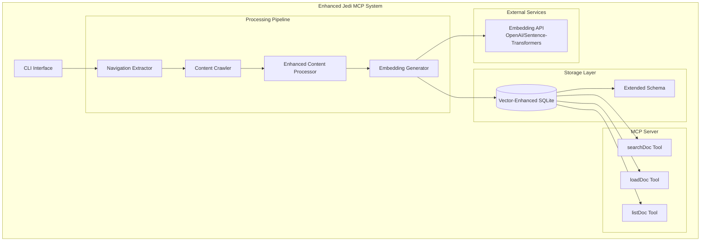

# Design Document: Vector Search Enhancement

## Overview

This design extends the existing Jedi MCP system with vector search capabilities, enabling semantic document search and retrieval through three new MCP tools: `searchDoc`, `loadDoc`, and `listDoc`. The enhancement integrates sqlite-vec extension for vector storage and search, implements text embedding generation, and provides improved document summaries optimized for semantic retrieval.

The system maintains the existing architecture while adding vector search capabilities through database schema extensions, new embedding processing components, and enhanced MCP tools that leverage semantic similarity for document discovery.

## Architecture

### High-Level Architecture



### Component Integration

The enhancement integrates with existing components:

- **Content Processor**: Enhanced to generate keyword-rich summaries and break content into searchable sections
- **Database Manager**: Extended with vector storage capabilities and new schema tables
- **MCP Server**: Augmented with three new tools for search, load, and list operations
- **Models**: Extended with new data structures for vector operations and search results

### Generation vs Serving Workflow

**Generation Phase** (jedi-mcp generate):
1. Read embedding model from environment variables (.env file)
2. Initialize EmbeddingGenerator with chosen sentence-transformers model
3. Store embedding model configuration in projects table for consistency
4. Generate embeddings for all document summaries and sections
5. Store embeddings in vector database with dynamic dimensions

**Serving Phase** (jedi-mcp serve):
1. Load project's embedding model configuration from database
2. Initialize EmbeddingGenerator with stored sentence-transformers model settings
3. Use same embedding model for query processing to ensure consistency
4. Serve MCP tools with proper embedding compatibility

## Components and Interfaces

### 1. Vector Database Manager

**Purpose**: Extends existing DatabaseManager with vector search capabilities

**Key Methods**:
```python
class VectorDatabaseManager(DatabaseManager):
    def initialize_vector_schema(self, project_name: str, embedding_config: EmbeddingConfig) -> None
    def store_project_embedding_config(self, project_name: str, config: EmbeddingConfig) -> None
    def get_project_embedding_config(self, project_name: str) -> EmbeddingConfig
    def store_document_embedding(self, doc_id: str, embedding: List[float], metadata: dict) -> None
    def search_similar_documents(self, query_embedding: List[float], limit: int = 10) -> List[SearchResult]
    def get_document_by_slug(self, slug: str) -> Optional[DocumentSummary]
    def list_all_documents(self, project_name: str) -> List[DocumentMetadata]
```

**Vector Schema Extensions**:
```sql
-- Document summaries with vector embeddings (dynamic dimension)
CREATE VIRTUAL TABLE document_embeddings USING vec0(
    slug TEXT PRIMARY KEY,
    project_id INTEGER,
    title TEXT,
    summary_text TEXT,
    category TEXT,
    embedding BLOB,  -- Dynamic dimension based on project's embedding model
    created_at TIMESTAMP,
    FOREIGN KEY (project_id) REFERENCES projects(id)
);

-- Document sections for granular search (dynamic dimension)
CREATE VIRTUAL TABLE section_embeddings USING vec0(
    section_id TEXT PRIMARY KEY,
    document_slug TEXT,
    section_title TEXT,
    section_content TEXT,
    embedding BLOB,  -- Dynamic dimension based on project's embedding model
    created_at TIMESTAMP,
    FOREIGN KEY (document_slug) REFERENCES document_embeddings(slug)
);
```

### 2. Embedding Generator

**Purpose**: Generate vector embeddings for document content

**Interface**:
```python
class EmbeddingGenerator:
    def __init__(self, provider: str = "openai", model: str = "text-embedding-3-small")
    def generate_embedding(self, text: str) -> List[float]
    def generate_batch_embeddings(self, texts: List[str]) -> List[List[float]]
    def get_embedding_dimension(self) -> int
```

**Supported Providers**:
- **Sentence Transformers**: `all-MiniLM-L6-v2` (384 dimensions, free, local processing, recommended default)
- **Sentence Transformers**: `Qwen3-Embedding-0.6B` (1024 dimensions, free, local processing)

**Environment Configuration**:
```bash
# .env file configuration during generation phase
JEDI_EMBEDDING_MODEL=all-MiniLM-L6-v2  # or Qwen3-Embedding-0.6B
```

**Configuration**:
```python
@dataclass
class EmbeddingConfig:
    provider: str = "sentence-transformers"  # Only sentence-transformers supported
    model: str = "all-MiniLM-L6-v2"  # Good quality, 384 dimensions
    dimension: int = 384  # Automatically determined from model
    batch_size: int = 100
    max_text_length: int = 8000
    chunk_overlap: int = 200
    
    @classmethod
    def from_env(cls) -> 'EmbeddingConfig':
        """Load configuration from environment variables."""
        model = os.getenv('JEDI_EMBEDDING_MODEL', 'all-MiniLM-L6-v2')
        
        # Determine dimension based on model
        dimension_map = {
            'all-MiniLM-L6-v2': 384,
            'Qwen3-Embedding-0.6B': 1024
        }
        dimension = dimension_map.get(model, 384)
        
        return cls(provider="sentence-transformers", model=model, dimension=dimension)
```

### 3. Enhanced Content Processor

**Purpose**: Extends existing ContentProcessor with vector-optimized summary generation

**Key Enhancements**:
```python
class EnhancedContentProcessor(ContentProcessor):
    def generate_searchable_summary(self, pages: List[PageContent]) -> SearchableDocument
    def extract_keywords(self, content: str) -> List[str]
    def create_document_sections(self, summary: str) -> List[DocumentSection]
    def optimize_for_retrieval(self, text: str) -> str
```

**Summary Generation Strategy**:
1. **Keyword Integration**: Include relevant technical terms, API names, and concepts
2. **Section Breakdown**: Split large summaries into logical sections with unique identifiers
3. **Context Preservation**: Ensure each section contains sufficient context for standalone understanding
4. **Retrieval Optimization**: Structure content to match common query patterns

### 4. Search Result Models

**Purpose**: Data structures for search operations

```python
@dataclass
class SearchResult:
    slug: str
    title: str
    category: str
    relevance_score: float
    content_preview: str
    section_matches: List[SectionMatch]

@dataclass
class SectionMatch:
    section_id: str
    section_title: str
    content_snippet: str
    relevance_score: float

@dataclass
class DocumentSummary:
    slug: str
    title: str
    category: str
    full_summary: str
    source_urls: List[str]
    created_at: str
    sections: List[DocumentSection]

@dataclass
class DocumentSection:
    section_id: str
    title: str
    content: str
    keywords: List[str]

@dataclass
class DocumentMetadata:
    slug: str
    title: str
    category: str
    description: str
    document_count: int
    last_updated: str
```

## Data Models

### Extended Database Schema

```sql
-- Enhanced projects table with embedding configuration
projects (
    id INTEGER PRIMARY KEY,
    name TEXT UNIQUE,
    root_url TEXT,
    embedding_model TEXT,     -- Store embedding model used during generation  
    embedding_dimension INTEGER, -- Store embedding dimension for consistency
    created_at TIMESTAMP
)

-- Enhanced content groups (existing, no changes needed)
content_groups (
    id INTEGER PRIMARY KEY,
    project_id INTEGER,
    name TEXT,
    summary_markdown TEXT,
    created_at TIMESTAMP
)

-- Document embeddings for vector search (dynamic dimension based on model)
document_embeddings (
    slug TEXT PRIMARY KEY,
    project_id INTEGER,
    content_group_id INTEGER,
    title TEXT,
    summary_text TEXT,
    category TEXT,
    keywords TEXT,  -- JSON array of keywords
    source_urls TEXT,  -- JSON array of source URLs
    embedding BLOB,  -- Dynamic dimension based on project's embedding model
    created_at TIMESTAMP
)

-- Section embeddings for granular search (dynamic dimension based on model)
section_embeddings (
    section_id TEXT PRIMARY KEY,
    document_slug TEXT,
    section_title TEXT,
    section_content TEXT,
    section_order INTEGER,
    embedding BLOB,  -- Dynamic dimension based on project's embedding model
    created_at TIMESTAMP
)

-- New: Search analytics (optional)
search_analytics (
    id INTEGER PRIMARY KEY,
    project_id INTEGER,
    query_text TEXT,
    results_count INTEGER,
    timestamp TIMESTAMP
)
```

### Vector Search Configuration

```python
@dataclass
class VectorSearchConfig:
    embedding_model: str = "all-MiniLM-L6-v2"  # Good quality, 384 dimensions
    embedding_dimension: int = 384  # Dynamic based on model
    search_limit: int = 10
    similarity_threshold: float = 0.7
    section_chunk_size: int = 1000
    section_overlap: int = 200
    enable_hybrid_search: bool = True  # Combine vector + keyword search
    
    @classmethod
    def from_project(cls, db_manager: VectorDatabaseManager, project_name: str) -> 'VectorSearchConfig':
        """Load configuration from project's stored embedding settings."""
        embedding_config = db_manager.get_project_embedding_config(project_name)
        return cls(
            embedding_model=embedding_config.model,
            embedding_dimension=embedding_config.dimension
        )
```
```

## MCP Tools Implementation

### 1. searchDoc Tool

**Purpose**: Semantic search across document summaries

**Interface**:
```python
@mcp.tool(name="searchDoc", description="Search documentation using semantic similarity")
def search_documents(
    query: str,
    project: Optional[str] = None,
    category: Optional[str] = None,
    limit: int = 5
) -> str:
    """
    Search for relevant documentation using semantic similarity.
    
    Args:
        query: Natural language search query
        project: Optional project name filter
        category: Optional category filter  
        limit: Maximum number of results (default: 5)
        
    Returns:
        JSON string with search results including slugs, titles, scores, and previews
    """
```

**Search Algorithm**:
1. Generate embedding for search query
2. Perform vector similarity search in document_embeddings table
3. Apply optional filters (project, category)
4. Rank results by relevance score
5. Include section-level matches for detailed context
6. Return structured results with slugs for loadDoc tool

### 2. loadDoc Tool

**Purpose**: Retrieve full document content using slugs from search results

**Interface**:
```python
@mcp.tool(name="loadDoc", description="Load full document content by slug")
def load_document(
    slug: str,
    include_sections: bool = True,
    include_metadata: bool = True
) -> str:
    """
    Load complete document summary by slug identifier.
    
    Args:
        slug: Document slug from search results
        include_sections: Include section breakdown (default: True)
        include_metadata: Include source URLs and metadata (default: True)
        
    Returns:
        Complete markdown document with metadata and sections
    """
```

**Response Format**:
```markdown
# Document Title

**Category:** API Reference
**Sources:** [url1, url2, url3]
**Last Updated:** 2024-01-15

## Summary

[Full document summary content...]

## Sections

### Section 1: Getting Started
[Section content...]

### Section 2: API Reference  
[Section content...]
```

### 3. listDoc Tool

**Purpose**: Browse available documentation topics and categories

**Interface**:
```python
@mcp.tool(name="listDoc", description="List available documentation topics and categories")
def list_documents(
    project: Optional[str] = None,
    category: Optional[str] = None,
    sort_by: str = "title"  # title, category, date
) -> str:
    """
    List all available documentation topics with metadata.
    
    Args:
        project: Optional project name filter
        category: Optional category filter
        sort_by: Sort order - title, category, or date (default: title)
        
    Returns:
        Structured list of documents with categories and descriptions
    """
```

**Response Format**:
```json
{
  "total_documents": 45,
  "categories": [
    {
      "name": "Getting Started",
      "document_count": 8,
      "documents": [
        {
          "slug": "getting-started-installation",
          "title": "Installation Guide", 
          "description": "Step-by-step installation instructions...",
          "last_updated": "2024-01-15"
        }
      ]
    }
  ]
}
```

## Correctness Properties

*A property is a characteristic or behavior that should hold true across all valid executions of a system-essentially, a formal statement about what the system should do. Properties serve as the bridge between human-readable specifications and machine-verifiable correctness guarantees.*

### Property 1: Summary Generation with Keywords and Sections
*For any* document content, when generating summaries, the system should include relevant keywords, break large content into topic-based sections with unique identifiers, and remove duplicates while preserving context
**Validates: Requirements 2.1, 2.2, 2.3**

### Property 2: Comprehensive Search Functionality  
*For any* search query, the searchDoc tool should perform vector-based semantic search, return results with slugs/titles/scores/previews, and support both semantic similarity and hybrid keyword-vector approaches
**Validates: Requirements 3.1, 3.2, 3.4**

### Property 3: Comprehensive Document Loading
*For any* valid document slug, the loadDoc tool should return complete summary markdown with metadata (source URLs, dates, categories) and support batch loading of multiple documents
**Validates: Requirements 4.1, 4.3, 4.4**

### Property 4: Document Listing Format
*For any* listDoc tool invocation, the returned data should include topic names, descriptions, document counts, category hierarchies, and support filtering by project, category, or content type
**Validates: Requirements 5.2, 5.4**

### Property 5: Data Organization and Relationships
*For any* stored data, the system should maintain clear organization between raw content and processed summaries while preserving relationships between source content and final summaries
**Validates: Requirements 6.1, 6.2**

### Property 6: Vector Database Storage and Search
*For any* document summary, when stored in the vector database, embeddings should be generated and stored correctly, and when performing searches, results should be ranked by vector similarity
**Validates: Requirements 1.2, 1.3**

## Error Handling

### Vector Database Errors
- **Extension Loading Failures**: Graceful fallback to keyword-only search if sqlite-vec extension fails to load
- **Embedding Generation Failures**: Retry with exponential backoff, fallback to alternative embedding provider
- **Vector Search Failures**: Fall back to traditional text search with appropriate user notification

### Embedding Service Errors
- **API Rate Limits**: Implement request queuing and retry logic with appropriate delays
- **Authentication Failures**: Clear error messages with configuration guidance
- **Network Timeouts**: Configurable timeout values with retry mechanisms
- **Quota Exceeded**: Graceful degradation with informative error messages

### Search and Retrieval Errors
- **Invalid Slugs**: Return structured error responses with suggested alternatives
- **Empty Search Results**: Provide helpful suggestions and related topics
- **Malformed Queries**: Input validation with clear error messages
- **Database Corruption**: Automatic schema validation and repair mechanisms

### Data Consistency Errors
- **Missing Embeddings**: Automatic regeneration for documents without embeddings
- **Orphaned Records**: Cleanup utilities for maintaining referential integrity
- **Schema Mismatches**: Migration utilities for database schema updates

## Testing Strategy

### Dual Testing Approach
The system requires both unit testing and property-based testing for comprehensive coverage:

- **Unit tests**: Verify specific examples, edge cases, and error conditions
- **Property tests**: Verify universal properties across all inputs
- Together: comprehensive coverage (unit tests catch concrete bugs, property tests verify general correctness)

### Unit Testing Focus Areas
- **Vector Database Initialization**: Test successful extension loading and schema creation
- **Embedding Generation**: Test with known inputs and expected outputs
- **Search Edge Cases**: Empty queries, invalid filters, no results scenarios
- **Error Conditions**: Network failures, invalid inputs, database errors
- **MCP Tool Integration**: Tool registration, parameter validation, response formatting

### Property-Based Testing Configuration
- **Testing Library**: Hypothesis for Python property-based testing
- **Test Iterations**: Minimum 100 iterations per property test
- **Test Tagging**: Each property test references its design document property
- **Tag Format**: **Feature: vector-search-enhancement, Property {number}: {property_text}**

### Property Test Implementation
Each correctness property will be implemented as a single property-based test:

1. **Property 1 Test**: Generate random document content, verify summary quality and structure
2. **Property 2 Test**: Generate random search queries, verify search functionality and response format
3. **Property 3 Test**: Generate random document slugs, verify loading functionality and metadata inclusion
4. **Property 4 Test**: Test listDoc tool with various filters, verify response structure and completeness
5. **Property 5 Test**: Generate random data, verify organization and relationship preservation
6. **Property 6 Test**: Generate random documents, verify embedding storage and search ranking

### Integration Testing
- **End-to-End Workflows**: Complete document processing pipeline from crawling to search
- **MCP Server Integration**: Full server startup and tool invocation testing
- **Database Migration**: Testing schema upgrades and data preservation
- **Multi-Project Support**: Testing isolation and cross-project functionality

### Performance Testing
- **Vector Search Performance**: Response times for various query types and database sizes
- **Embedding Generation**: Batch processing performance and memory usage
- **Concurrent Access**: Multiple simultaneous search and load operations
- **Storage Scaling**: Performance with large document collections

### Test Data Management
- **Synthetic Data Generation**: Create realistic test documents and queries
- **Embedding Mocking**: Mock embedding services for consistent testing
- **Database Fixtures**: Reusable test databases with known content
- **Cleanup Utilities**: Automatic test data cleanup and isolation